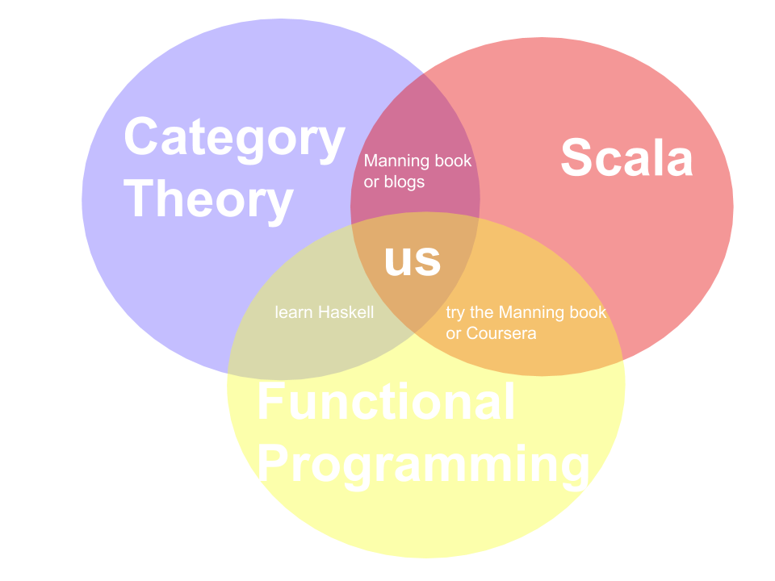

# README

**Here is a talk the author gave that gives a little background**

from Bartosz Milewskis book on Category Theory

and help from others, particularly

* @elbaulp [https://github.com/elbaulp/Scala-Category-Theory](https://github.com/elbaulp/Scala-Category-Theory)
* @onlurking [https://github.com/onlurking/category-theory-for-programmers](https://github.com/onlurking/category-theory-for-programmers) 

## About

I want to learn Category Theory, Functional Programming, and Scala.

* [ ] scala - [https://www.scala-lang.org/](https://www.scala-lang.org/) 
* [ ] category theory - [https://bartoszmilewski.com/2014/10/28/category-theory-for-programmers-the-preface/](https://bartoszmilewski.com/2014/10/28/category-theory-for-programmers-the-preface/)
* [ ] some FP - [https://www.coursera.org/learn/progfun1](https://www.coursera.org/learn/progfun1)

## And to make sure we stand on the shoulders of giants:

_\(We can check them off as we absorb their smarticles\)_

* \[X\] others already doing this in scala [https://github.com/elbaulp/Scala-Category-Theory](https://github.com/elbaulp/Scala-Category-Theory)
* \[X\] others compiling nice books  [https://github.com/onlurking/category-theory-for-programmers](https://github.com/onlurking/category-theory-for-programmers) 
* [ ] reading great blogs [https://bartoszmilewski.com/2014/10/28/category-theory-for-programmers-the-preface/](https://bartoszmilewski.com/2014/10/28/category-theory-for-programmers-the-preface/) 
* [ ] making cool courses [https://www.coursera.org/learn/progfun1](https://www.coursera.org/learn/progfun1)
* [ ] writing about languages they designed [https://www.artima.com/shop/programming\_in\_scala\_3ed](https://www.artima.com/shop/programming_in_scala_3ed) 
* [ ] letting you run excercises in your browser [https://www.scala-exercises.org/fp\_in\_scala/getting\_started\_with\_functional\_programming](https://www.scala-exercises.org/fp_in_scala/getting_started_with_functional_programming) 
* [ ] writing books that need to be read [https://www.manning.com/books/functional-programming-in-scala](https://www.manning.com/books/functional-programming-in-scala) 
* [ ] and the code that needs to be run [https://github.com/fpinscala/fpinscala](https://github.com/fpinscala/fpinscala) 

## Getting Started

PLEASE :heart: submit a pull request or issue, just to say hi :smiley:

### Part 1

Merging [https://github.com/elbaulp/Scala-Category-Theory](https://github.com/elbaulp/Scala-Category-Theory) and [https://github.com/onlurking/category-theory-for-programmers](https://github.com/onlurking/category-theory-for-programmers) so we can have one giant happy repo where we can

* [ ] Read _Category Theory for Programmers_
* [ ] Run, fiddle with, or extend the code in `scala` \(but trying `golang` crossed my mind\)

