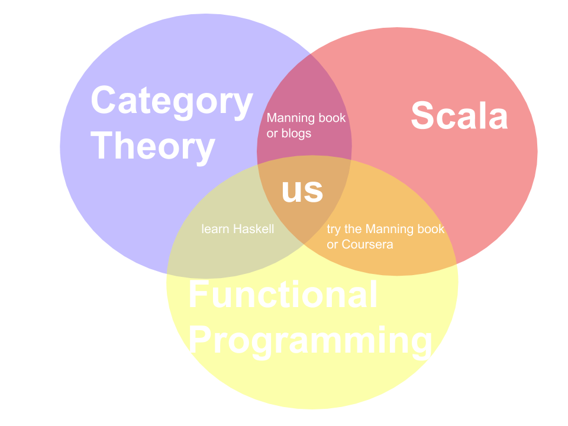

# Category Theory for Programmers (in Scala)
from Bartosz Milewskis book on Category Theory 

and help from others, particularly 
- @elbaulp https://github.com/elbaulp/Scala-Category-Theory
- @onlurking https://github.com/onlurking/category-theory-for-programmers 

## About 

I want to learn Category Theory, Functional Programming, and Scala. 

We gound great resources, partiularly
- others already doing this in scala https://github.com/elbaulp/Scala-Category-Theory
- others compiling nice books  https://github.com/onlurking/category-theory-for-programmers 
- 

## Getting Started 

PLEASE :heart: 