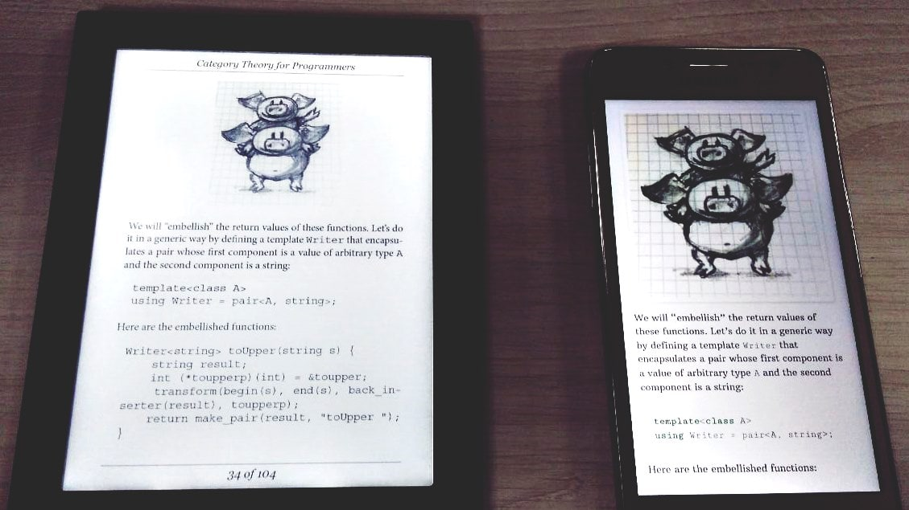

<<<<<<< HEAD
<<<<<<< HEAD
# Category Theory for Programmers (in Scala)
from Bartosz Milewskis book on Category Theory 

and help from others, particularly 
- @elbaulp https://github.com/elbaulp/Scala-Category-Theory
- @onlurking https://github.com/onlurking/category-theory-for-programmers 
=======
# Scala-Category-Theory

[Bartosz Milewski](https://bartoszmilewski.com/2014/10/28/category-theory-for-programmers-the-preface/) great book on *Category Theory* implemented in scala, with Property Tests.

I will be posing my own take on category theory as I read through the book, think of it as a sort of a summary of the book, with code explanations.

## Table of Contents

You can check the Table of Contents in my blog: [Scala Category Theory - Table of Contents](https://elbauldelprogramador.com/en/scala-category-theory/)

- [Composition](https://elbauldelprogramador.com/en/scala-category-theory-composition/)
- [Types & Functions](https://elbauldelprogramador.com/en/scala-category-theory-types/)

# Other resources

There are a great amount of resources on the Bartosz series, here are a few:

- [typelevel/CT\_from\_Programmers.scala](https://github.com/typelevel/CT_from_Programmers.scala/tree/master/src/main/tut): Scala sample code for Bartosz Milewski's CT for Programmers
- [hmemcpy/milewski-ctfp-pdf](https://github.com/hmemcpy/milewski-ctfp-pdf): Bartosz Milewski's 'Category Theory for Programmers' unofficial PDF and LaTeX source

# Why another repository about Bartosz's Category Theory Book?

I just wanted to learn more about Category Theory, so I decided to start reading the book and doing all the proposed exercises. But in addition of just writing _scala code_, I've implemented **Property tests** using `ScalaTest` support for `ScalaCheck`.

# [ImpoSter Syndrome Disclaimer](https://github.com/adriennefriend/imposter-syndrome-disclaimer)
A warm invitation to contribute, to be adapted and included in your project's README

## How to contribute

*Imposter syndrome disclaimer*: I want your help. No really, I do.

There might be a little voice inside that tells you you're not ready; that you need to do one more tutorial, or learn another framework, or write a few more blog posts before you can help me with this project.

I assure you, that's not the case.

This project has some clear Contribution Guidelines and expectations that you can read here ([link](.github/CONTRIBUTING.md)).

The contribution guidelines outline the process that you'll need to follow to get a patch merged. By making expectations and process explicit, I hope it will make it easier for you to contribute.

And you don't just have to write code. You can help out by writing documentation, tests, or even by giving feedback about this work. (And yes, that includes giving feedback about the contribution guidelines.)

Thank you for contributing!
>>>>>>> sct/master
=======
# Category Theory for Programmers [WIP]

This is an e-book version of Bartosz Milewski's [Category Theory for Programmers](https://bartoszmilewski.com/2014/10/28/category-theory-for-programmers-the-preface/) work.

**You can download the latest epub build** [**here**](https://github.com/onlurking/category-theory-for-programmers/releases/download/0.3-alpha/category-theory-for-programmers.epub) (the last chapter is **Monads, Monoids, and Categories**).

## Roadmap

### Part One

- [x] Category: The Essence of Composition
- [x] Types and Functions
- [x] Categories Great and Small
- [x] Kleisli Categories
- [x] Products and Coproducts
- [x] Simple Algebraic Data Types
- [x] Functors
- [x] Functoriality
- [x] Function Types
- [x] Natural Transformations

### Part Two

- [x] Declarative Programming
- [x] Limits and Colimits
- [x] Free Monoids
- [x] Representable Functors
- [x] The Yoneda Lemma
- [x] Yoneda Embedding

### Part Three

- [x] It’s All About Morphisms
- [x] Adjunctions
- [x] Free/Forgetful Adjunctions
- [x] Monads: Programmer’s Definition
- [x] Monads and Effects
- [x] Monads Categorically
- [x] Comonads
- [x] F-Algebras
- [x] Algebras for Monads
- [x] Ends and Coends
- [x] Kan Extensions
- [x] Enriched Categories
- [x] Topoi
- [x] Lawvere Theories
- [x] Monads, Monoids, and Categories 

## Credits

This project is powered by [pandoc](https://pandoc.org/), evangoer's [pandoc-ebook-template
](https://github.com/evangoer/pandoc-ebook-template) and the CSS is somewhat based on [Standard Ebooks](https://standardebooks.org/contribute/a-basic-standard-ebooks-source-folder).

All the credits go to the original [author](https://bartoszmilewski.com/about).

>>>>>>> ctfp/master
